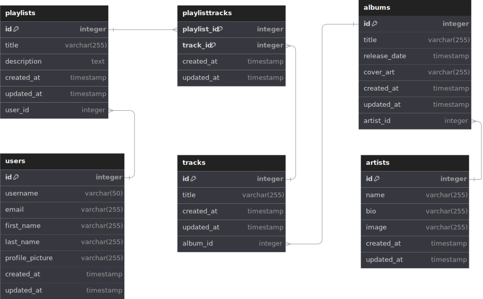

# MusicHits2000 REST API

MusicHits2000 is a RESTful API designed to manage a music library. It allows users to perform CRUD operations on artists, albums, playlists, and tracks. The API is built using Node.js with the Hono framework, and it uses PostgreSQL as the database, managed through Prisma ORM. The project is written in TypeScript to ensure type safety and maintainability.

## Stack Information

- **Backend**: Node.js
- **Framework**: Hono
- **Database**: PostgreSQL
- **ORM**: Prisma
- **Language**: TypeScript

## List of API Endpoints

### Artists

- **POST** `/api/artists/seed`: Create a dummy artist in the database
- **POST** `/api/artists/add`: Create a new artist in the database
- **GET** `/api/artists`: Get all artists
- **GET** `/api/artists/detail/{id}`: Get artist by id
- **GET** `/api/artists/albums`: Get artist with albums
- **PUT** `/api/artists/update/{id}`: Update artist by id
- **DELETE** `/api/artists/delete/{id}`: Delete artist by id
- **DELETE** `/api/artists/delete-all`: Delete all artists

### Albums

- **POST** `/api/albums/seed`: Create a dummy album in the database
- **POST** `/api/albums/add`: Create a new album in the database
- **GET** `/api/albums`: Get all albums
- **GET** `/api/albums/detail/{id}`: Get album by id
- **PUT** `/api/albums/update/{id}`: Update album by id
- **DELETE** `/api/albums/delete/{id}`: Delete album by id
- **DELETE** `/api/albums/delete-all`: Delete all albums

### Playlists

- **POST** `/api/playlists/seed`: Create a dummy playlist in the database
- **POST** `/api/playlists/add`: Create a new playlist in the database
- **GET** `/api/playlists`: Get all playlists
- **GET** `/api/playlists/detail/{id}`: Get playlist by id
- **GET** `/api/playlists/tracks`: Get all playlists with tracks
- **PUT** `/api/playlists/update/{id}`: Update playlist by id
- **DELETE** `/api/playlists/delete/{id}`: Delete playlist by id
- **DELETE** `/api/playlists/delete-all`: Delete all playlists
- **POST** `/api/playlists/playlisttrack/add`: Create a new playlist with tracks in the database

### Tracks

- **POST** `/api/tracks/seed`: Create a dummy track in the database
- **POST** `/api/tracks/add`: Create a new track in the database
- **GET** `/api/tracks`: Get all tracks
- **GET** `/api/tracks/detail/{id}`: Get track by id
- **PUT** `/api/tracks/update/{id}`: Update track by id
- **DELETE** `/api/tracks/delete/{id}`: Delete track by id
- **DELETE** `/api/tracks/delete-all`: Delete all tracks

## Database Design

For more detail information you can visit this link ->
[ERD](https://dbdiagram.io/d/music_pedia-6759b12c46c15ed4791089f9)



## How to Run This Project

To install dependencies:

```sh
bun install
```

To run:

```sh
bun run dev
```

Open [http://localhost:3000](http://localhost:3000)
